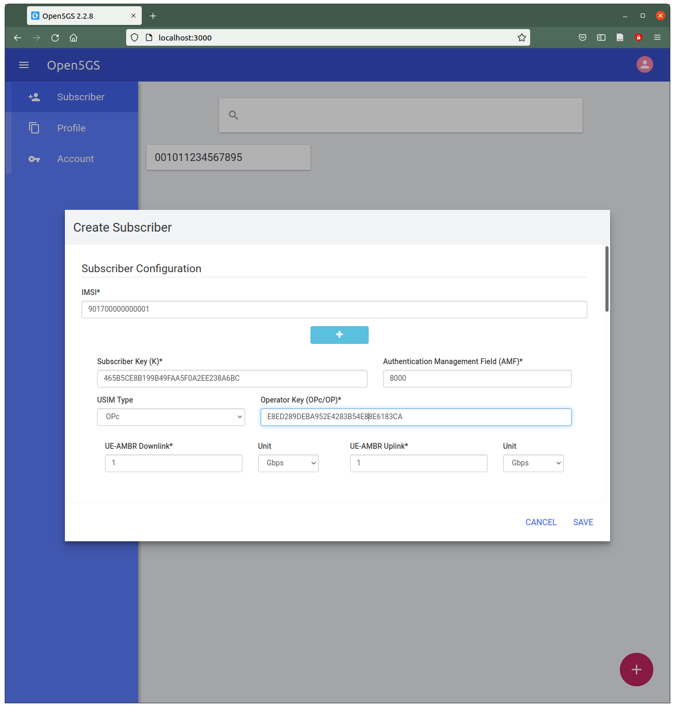
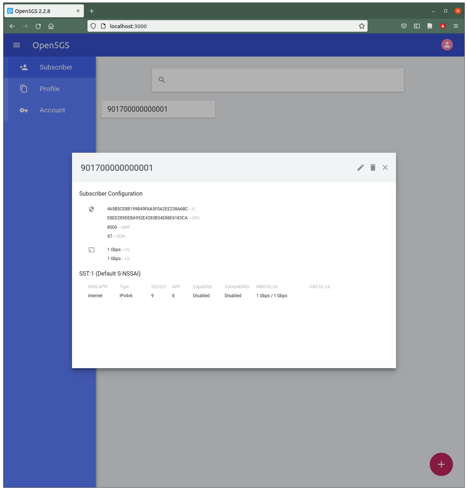

# comnetsemu_open5gs
Deploy open5gs and ueransim in comnetsemu to perform cp state access measurements.

## Setup
1. Get comnetsemu source from [here](https://git.comnets.net/public-repo/comnetsemu).

2. Clone this repository into the comnetsemu folder (to sync with the host).

3. Patch the `Vagrantfile` in comnetsemu with `git apply comnetsemu_open5gs/vagrantfile.patch`.

4. Install comnetsemu using [Option 1](https://git.comnets.net/public-repo/comnetsemu#option-1-install-in-a-vagrant-managed-vm-highly-recommended).

5. Enter comnetsemu VM `vagrant ssh comentsemu` and navigate to `cd /comnetsemu/comnetsemu_open5gs/open5gs`

6. Clone the open5gs source from [here](https://github.com/Molle94/open5gs) and then switch to the dev branch (modified source from fixed version)

7. Build UERANSIM and open5gs container with the respective `build_image.sh` script in `ueransim` and `open5gs`.

## Experiments
Run the emulation 
```
$ sudo python3 topo.py -i
```
The `-i` argument automatically spawns the XTerm displays for the docker hosts. In the xterms run following commands to start the 5G core network, the gNB and the UE
```
5gc: $ ./install/etc/open5gs/start_open5gs.sh       # Wait until the core is booted, approx. 10s
gnb: $ ./nr-gnb -c /mnt/ueransim/open5gs-gnb.yaml
ue:  $ ./nr-ue -c /mnt/ueransim/open5gs-ue.yaml
```
After the first boot of the 5GC, the UE must be registered in the database through WebUI (see below).
To check whether everything was setup successfully, in a new window enter the UE container with `docker exec -it ue /bin/bash` and start a ping with `ping -I uesimtun0 -c 3 www.google.com`.

To quit the interactive emulation terminate core, gnb and ue with `ctrl + c`, run `quit` in the mininet cli.

### UE registration
UEs can be configured using the WebUI of open5gs. In your browser open `localhost:3000` (username: admin, password: 1423). 
The configuration is then as follows:  
- IMSI: 901700000000001  
- Key: 465B5CE8B199B49FAA5F0A2EE238A6BC (remove spaces from the default)  
- OPc: E8ED289DEBA952E4283B54E88E6183CA (remove spaces from the default)  
- Slice config: leave as is  



